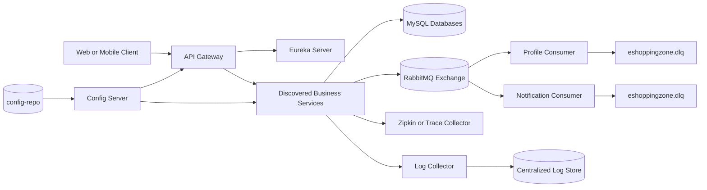

# EShoppingZone

EShoppingZone is a Spring Boot and Spring Cloud e-commerce platform composed of independently deployable microservices.

### Ready for Testing
- ✅ Auth Service
- ✅ Profile Service
- ✅ Product Service
- ✅ Cart Service
- ✅ Order Service
- ✅ Payment Service
- ✅ Inventory Service
- ✅ Delivery Service
- ✅ Notification Service
- ✅ Wallet Service
- ✅ API Gateway

### Platform Components

- Config Server: centralized configuration from `config-repo`
- Eureka Server: service registration and discovery
- API Gateway: single entry point for client traffic, authentication filtering, and rate limiting
- Auth Service: registration, authentication, JWT issuance, and user events
- Profile Service: user profiles and addresses
- Product Service: product and category management
- Inventory Service: stock management
- Cart Service: shopping cart management
- Order Service: order lifecycle and order events
- Payment Service: payment and refund workflows
- Wallet Service: wallet balances and transactions
- Delivery Service: delivery assignment and status management
- Notification Service: asynchronous user, order, payment, and delivery notifications

### Completed Cross-Cutting Capabilities

- Centralized structured logging using Spring Boot ECS JSON console output
- Distributed tracing using Micrometer Tracing, Brave, and Zipkin-compatible export
- Trace observation for HTTP requests and RabbitMQ publishers/listeners
- RabbitMQ retry and dead-letter handling for Profile and Notification consumers
- Three listener attempts with exponential backoff before failed messages are republished to `eshoppingzone.dlq`

The service business workflows remain under active testing. The observability and messaging foundations are implemented without changing existing service queue names or event routing keys.

## Local Prerequisites

- Java 21
- Maven 3.9 or later
- MySQL
- RabbitMQ
- Zipkin, or another collector compatible with the configured Zipkin endpoint

The default local endpoints are:

| Component | Default endpoint |
| --- | --- |
| Eureka | `http://localhost:8761` |
| Config Server | `http://localhost:8888` |
| RabbitMQ | `localhost:5672` |
| Zipkin | `http://localhost:9411` |

Start the parent build from the repository root:

```bash
./mvnw clean verify
```

On Windows, use `mvnw.cmd clean verify`. The Maven Wrapper downloads Maven 3.9.9 into `.mvn/wrapper/dists` on first use.

Every push and pull request targeting `main`, `master`, or `develop` runs the same command through [GitHub Actions](.github/workflows/ci.yml). The workflow uses Java 21, Maven dependency caching, and uploads Surefire reports when tests fail.

## Automated Testing

The repository contains JUnit 5 and Mockito unit tests for each business service and the API Gateway filters. Additional focused tests cover the Profile and Notification RabbitMQ DLQ declarations and listener factory wiring. Run unit tests with:

```bash
./mvnw test
```

The Profile module includes a Testcontainers integration test that starts RabbitMQ in Docker and verifies the real DLX-to-DLQ route. `./mvnw verify` runs these `*IT` tests through Maven Failsafe, so Docker must be available for the full build. Unit tests remain Docker-free.

The API Gateway includes an opt-in end-to-end health smoke test. Run it against an already running gateway with:

```bash
E2E_BASE_URL=http://localhost:8080 ./mvnw -pl api-gateway -De2e.run=true verify
```

On Windows PowerShell:

```powershell
$env:E2E_BASE_URL = "http://localhost:8080"
./mvnw.cmd -pl api-gateway -De2e.run=true verify
```

The normal GitHub Actions CI job runs unit and RabbitMQ integration tests on Docker-enabled runners. The gateway E2E test remains opt-in because it requires a deployed gateway and its dependent services.

Configuration is loaded through the Config Server from [config-repo](config-repo). The most relevant environment variables are:

```text
EUREKA_SERVER_URL=http://localhost:8761/eureka/
RABBITMQ_HOST=localhost
RABBITMQ_PORT=5672
RABBITMQ_USERNAME=guest
RABBITMQ_PASSWORD=guest
ZIPKIN_ENDPOINT=http://localhost:9411/api/v2/spans
TRACING_SAMPLING_PROBABILITY=1.0
LOG_FORMAT=ecs
APP_ENVIRONMENT=local
```

Do not commit production credentials. Override database, RabbitMQ, JWT, and tracing values through deployment environment variables or a secured configuration repository.

## Observability

### Centralized Logging

The shared configuration in [config-repo/application.yml](config-repo/application.yml) enables ECS structured console output. Every service writes machine-readable JSON containing the service identity and logging context. This output can be collected by Fluent Bit, Filebeat, Logstash, or a container platform and forwarded to a centralized Elasticsearch-compatible logging system.

The service name comes from `spring.application.name`, while deployment metadata can be set with `SERVICE_VERSION`, `APP_ENVIRONMENT`, and `LOG_FORMAT` (`ecs` by default).

### Distributed Tracing

Micrometer Tracing with the Brave bridge is inherited from the parent [pom.xml](pom.xml). HTTP calls and asynchronous RabbitMQ operations use the trace context supplied by the framework. Spans are exported to `${ZIPKIN_ENDPOINT:http://localhost:9411/api/v2/spans}`.

Sampling is controlled with `TRACING_SAMPLING_PROBABILITY`. Use a lower value in production when full sampling is too expensive.

### RabbitMQ Dead-Letter Queue

Existing event queues remain unchanged. The Profile and Notification services define:

- Dead-letter exchange: `eshoppingzone.dlx`
- Dead-letter queue: `eshoppingzone.dlq`
- Dead-letter routing key: `failed`

Listener failures are retried three times with exponential backoff. After the final failure, `RepublishMessageRecoverer` republishes the original message and failure metadata to the DLX. This keeps failed events available for inspection or controlled replay instead of silently losing them.

## Architecture

### Service Map

| Component | Responsibility | Primary communication | Persistence or dependency |
| --- | --- | --- | --- |
| API Gateway | Authentication filtering, routing, and rate limiting | HTTP | Eureka and downstream services |
| Auth Service | Registration, authentication, JWT, and user events | REST and RabbitMQ | MySQL |
| Profile Service | Profiles, addresses, and user event consumption | REST and RabbitMQ | MySQL |
| Product Service | Products and categories | REST and Feign | MySQL |
| Inventory Service | Stock and reservations | REST and Feign | MySQL |
| Cart Service | Shopping cart operations | REST and Feign | MySQL |
| Order Service | Order creation, status, and lifecycle events | REST, Feign, and RabbitMQ | MySQL |
| Payment Service | Payments and refunds | REST, Feign, and RabbitMQ | MySQL |
| Wallet Service | Wallet balances and transactions | REST and RabbitMQ | MySQL |
| Delivery Service | Assignment and delivery status | REST, Feign, and RabbitMQ | MySQL |
| Notification Service | User, order, payment, and delivery notifications | RabbitMQ | MySQL |

### Infrastructure Map

| Infrastructure | Purpose | Default location |
| --- | --- | --- |
| Config Server | Serves shared and service-specific configuration | `http://localhost:8888` |
| Eureka Server | Service registration and discovery | `http://localhost:8761` |
| RabbitMQ | Domain event transport and asynchronous processing | `localhost:5672` |
| `eshoppingzone.dlx` / `eshoppingzone.dlq` | Failed-message retention after consumer retries | RabbitMQ |
| Zipkin | Distributed trace collection | `http://localhost:9411` |
| Log collector | Ships ECS JSON logs to centralized storage | Deployment-specific |

### Communication Contracts

| Flow | Contract | Reliability behavior |
| --- | --- | --- |
| Client to gateway | HTTP/JSON | Authentication and rate limiting at the edge |
| Service to service | OpenFeign/HTTP | Trace context propagated across requests |
| Service to service events | RabbitMQ topic exchange | Trace observation and asynchronous delivery |
| Consumer failure | Retry interceptor and DLX republish | Three attempts, then `eshoppingzone.dlq` |
| Service configuration | Spring Cloud Config | Environment variables override defaults |



### Request Flow

1. A client sends an HTTP request to the API Gateway.
2. Gateway filters authenticate the request and apply rate limiting.
3. The gateway resolves the destination through Eureka service discovery.
4. The target service handles the request and uses its configured database.
5. OpenFeign clients call other services where a synchronous response is required.
6. Micrometer tracing propagates the request trace across service boundaries and exports spans to Zipkin.
7. Services emit ECS JSON logs containing service and trace context for centralized collection.

### Event Flow

1. A business service publishes an event to the shared `eshoppingzone.exchange` RabbitMQ topic exchange.
2. Queues bind to event routing keys such as user, order, payment, delivery, and refund events.
3. Profile and Notification consumers process their subscribed events asynchronously.
4. RabbitMQ observation propagates trace context from the publisher to the consumer.
5. Consumer failures are retried locally; exhausted retries are republished to `eshoppingzone.dlx` and stored in `eshoppingzone.dlq`.

### Configuration Flow

1. Each service starts with service-specific configuration in `config-repo/<service-name>.yml`.
2. Shared infrastructure settings come from `config-repo/application.yml`.
3. Config Server exposes the merged configuration to registered services.
4. Environment variables override local defaults for deployment-specific values.

## Repository Layout

```text
config-repo/       Shared and service-specific external configuration
config-server/     Spring Cloud Config Server
eureka-server/     Service registry
api-gateway/       Edge routing, authentication, and rate limiting
*-service/         Business microservices
pom.xml            Parent build and shared dependency management
```

## How to Get Latest Updates

```bash
git pull
```
